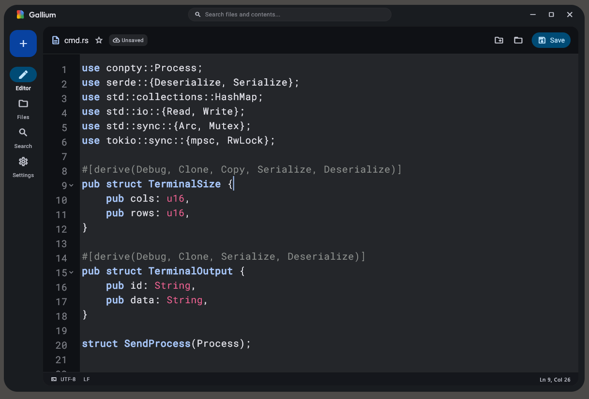

# Gallium

A minimalist document editor for desktop, built with Flutter and
Material Design 3. Gallium provides a clean, focused editing experience
with syntax highlighting for 14+ languages, file tree navigation,
full-text search, and customizable themes.



## Key Subsystems

- **Editor** -- Syntax-highlighted code and text editing with find and
  replace, undo/redo, and keyboard shortcuts.
- **File Tree** -- Workspace navigation with expandable directory trees,
  recent files, and drag-to-open support.
- **Search** -- Full-text search across workspace files with case-sensitive
  and regex modes.
- **Settings** -- Theme switching (light/dark/system), font selection, and
  editor customization.
- **Installer** -- Zero-interaction Windows installer with automatic
  shortcut creation and uninstaller registration.

## Quick Start

### Prerequisites

- [Flutter SDK](https://docs.flutter.dev/get-started/install) >= 3.12.1
- Windows 10/11, macOS 13+, or Linux (GTK3)

### Run

```bash
git clone https://github.com/maaamahAhh/gallium.git
cd gallium
flutter pub get
flutter run -d windows
```

### Build

```bash
flutter build windows --release
```

The release binary is output to `build/windows/x64/runner/Release/`.

### Build Installer

The installer requires a pre-built release binary packaged as a ZIP
archive:

```bash
# Build the editor first (if not already done)
flutter build windows --release

# Package the release into the installer assets
powershell -Command "Compress-Archive -Path `
  'build\windows\x64\runner\Release\*' `
  -DestinationPath 'installer\assets\data\gallium_release.zip' -Force"

# Build the installer
cd installer
flutter pub get
flutter build windows --release
```

The installer binary is output to
`installer/build/windows/x64/runner/Release/`.

## Supported Languages

Dart, Java, JavaScript, TypeScript, Python, Go, Rust, C/C++, Bash,
SQL, JSON, YAML, XML, HTML, CSS, Markdown.

## Documentation

- [Architecture Overview](docs/architecture.md)
- [Architecture Decision Records](docs/decisions/)
- [Contributing Guide](CONTRIBUTING.md)
- [Security Policy](SECURITY.md)

## Contributing

We welcome contributions. All submissions require review via GitHub pull
requests. Please read the [Contributing Guide](CONTRIBUTING.md) for details
on code style, testing, and commit message format.

## License

This is free and unencumbered software released into the public domain.
See [LICENSE](LICENSE) for more information.

## Third-Party Licenses

This project includes code from the following third-party packages:

- **flutter_code_editor** (Apache 2.0) -- Copyright 2022 Akvelon Inc.
- **code_field** (MIT) -- Copyright 2021 Bertrand Bevillard

See [packages/flutter_code_editor/LICENSE](packages/flutter_code_editor/LICENSE)
for full license texts.
